## Administration

- How to manage users and roles — create users, assign roles (admin, registrar, viewer), permissions model

- How to configure programme/project settings — programme hierarchy, geographic scope, active periods

## Setup

::: {.callout-important title="Who does what"}
Setup tasks happen in two places. Each section below is labelled accordingly.

| Label | Where | Who |
|---|---|---|
| **[PORTAL]{.badge-portal}** | BRaVe Management Portal (web browser) | Administrator / Programme Officer |
| **[MOBILE]{.badge-mobile}** | BRaVe mobile app (Android phone or tablet) | Enumerator |
| **[DESKTOP]{.badge-desktop}** | BRaVe Card Printing App (Windows PC with card printer) | Card printing operator |

: {tbl-colwidths="[15,45,40]"}

These labels are used throughout this guide, not only in the Setup section.
:::

```{=html}
<style>
.badge-portal { background:#2c3e78; color:#fff; padding:2px 8px; border-radius:4px; font-size:0.8em; }
.badge-mobile { background:#1e7d4f; color:#fff; padding:2px 8px; border-radius:4px; font-size:0.8em; }
.badge-desktop { background:#8a5a00; color:#fff; padding:2px 8px; border-radius:4px; font-size:0.8em; }
</style>
```

### Before you begin

You will need:

- A BRaVe **tenant** for your mission, created by the BRaVe support team. Each mission runs in its own tenant so its data is isolated.
- A portal account with the **Program Admin** role (IOM staff sign in with their IOM account; implementing partners use the Partner login).
- The portal address for your environment:
  - Testing/UAT: `https://testportal.brave.iom.int`
  - Production: `https://portal.brave.iom.int`
- For device setup: the Android phones or tablets you will use in the field, with the BRaVe app installed and **provisioned** (linked to your tenant). See *How to install BRaVe* in the Device Management section.

::: {.callout-note}
Biometric capture is optional and configurable per activity. Devices only need a fingerprint scanner if your activities require biometrics.
:::

### Portal setup [PORTAL]{.badge-portal}

#### How to sign in to the Management Portal

1. Open the portal address in your browser.
2. Choose a login method: click **IOM Staff Login** (authenticates with your IOM Microsoft account) or **Partner Login** for implementing-partner accounts (@fig-login).
3. Complete the multi-factor authentication prompt if requested.

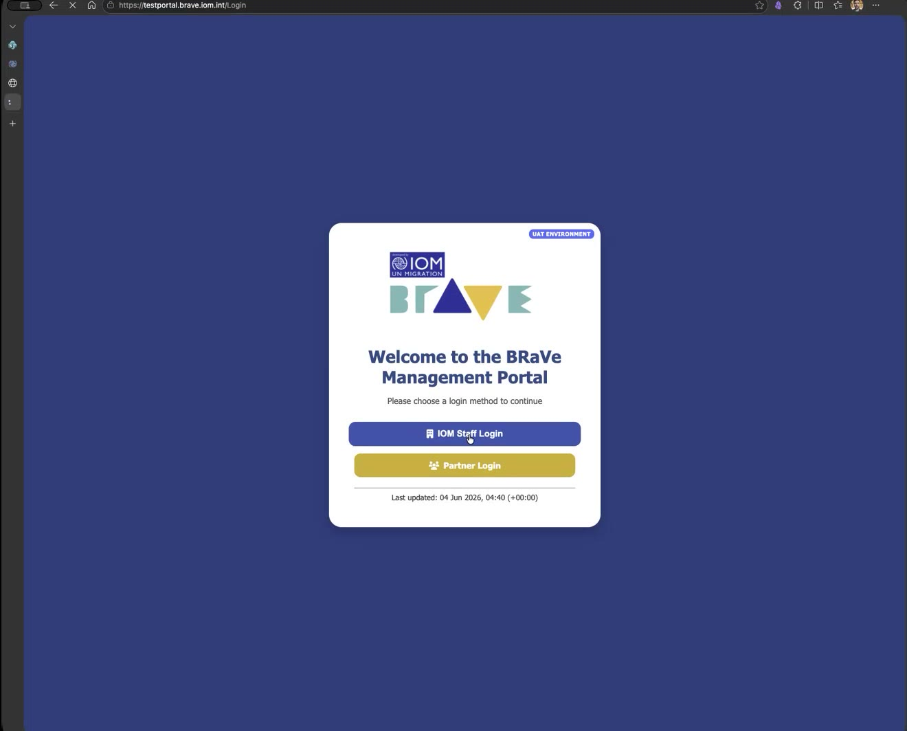{#fig-login width=75%}

After signing in you land on the **Dashboard**. The left-hand menu follows the operational workflow from top to bottom: Users, Registration, Deduplication, Targeting, Assistances, Data Exchange, Configuration and Monitoring (@fig-dashboard).

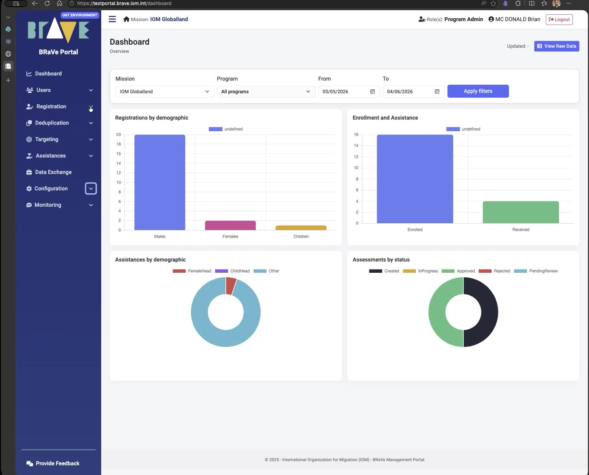{#fig-dashboard}

#### How to set up a registration programme

Every mission needs at least one registration programme. The programme records the purpose of the registration and carries the **Risk Benefit Assessment (RBA)**, which must be approved before activities can start.

1. In the left menu, open the **Programs** page.
2. Click to add a new programme and complete the RBA form: the purpose of the registration activity, target population groups, who data will be shared with, and where it takes place.
3. Submit the programme. It goes through an **approval process**; its status is shown in the programme list (@fig-programs).
4. Once the status is **Approved**, you can add activities to the programme.

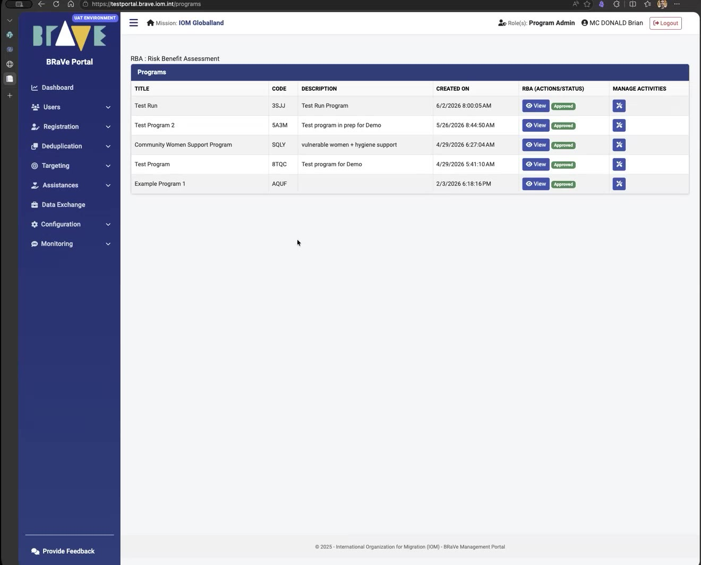{#fig-programs}

::: {.callout-tip}
If your mission has already completed a risk assessment outside BRaVe, the support team can transpose your existing programme into the system.
:::

#### How to configure activities

Activities are the working unit of BRaVe: registrations, record checks and distributions all happen *within* an activity. Think of activities as buckets — create as many or as few as you need.

1. From the programme list, click **Manage Activities** on an approved programme.
2. Click **+ Setup Activity** (@fig-activities).
3. Give the activity a title, description, and start and end dates.
4. Attach the configuration the activity needs:
   - one or more **consent forms** (multiple languages are supported, e.g. Portuguese);
   - the **household-level** and **individual-level surveys** to use;
   - **preferences**, such as whether biometrics are collected in this activity;
   - the **enumerators** allowed to work in it (the whitelist).
5. Save the activity. BRaVe assigns it a short **activity code** (e.g. `8GZ9`) — enumerators use this code to download the activity onto their devices.

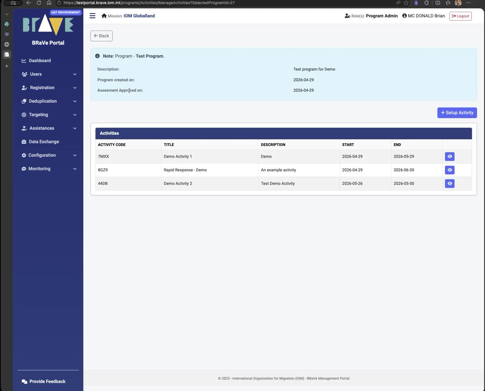{#fig-activities}

::: {.callout-note}
Consent forms and surveys are attached per activity, so different activities can collect different data — for example biometrics in one activity and none in another.
:::

#### How to create distribution items, kits and distribution types

If you will use BRaVe for assistance delivery, configure what is distributed before the distribution starts. The hierarchy is: **item types** (e.g. tarpaulin, rope) are grouped into **kit types** (e.g. Emergency Shelter Kit), which are attached to a **distribution type** (e.g. Emergency Shelter Distribution).

1. In the left menu, open the distributions configuration page. It has three tabs: **Distribution Types**, **Kit Types** and **Item Types** (@fig-dist-types).
2. On **Item Types**, create the individual items with their SKU, unit of measure (UoM) and quantity.
3. On **Kit Types**, create kits and add items to them.
4. On **Distribution Types**, click **+ Add Distribution Type** and name the distribution.
5. Open **Manage Items** on the new distribution type and use **+ Add Kit to this distribution** or **+ Add Item to this distribution** to define what each beneficiary receives (@fig-dist-kit).

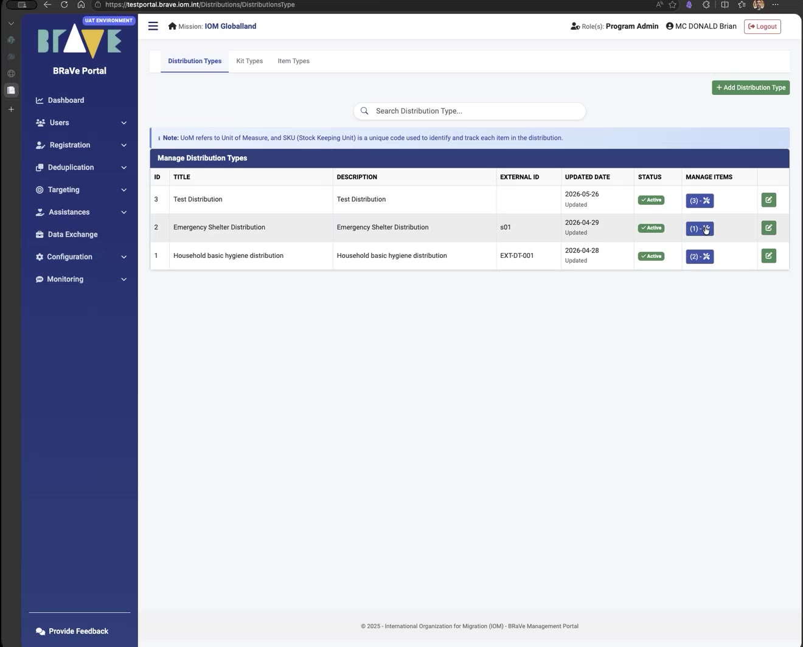{#fig-dist-types}

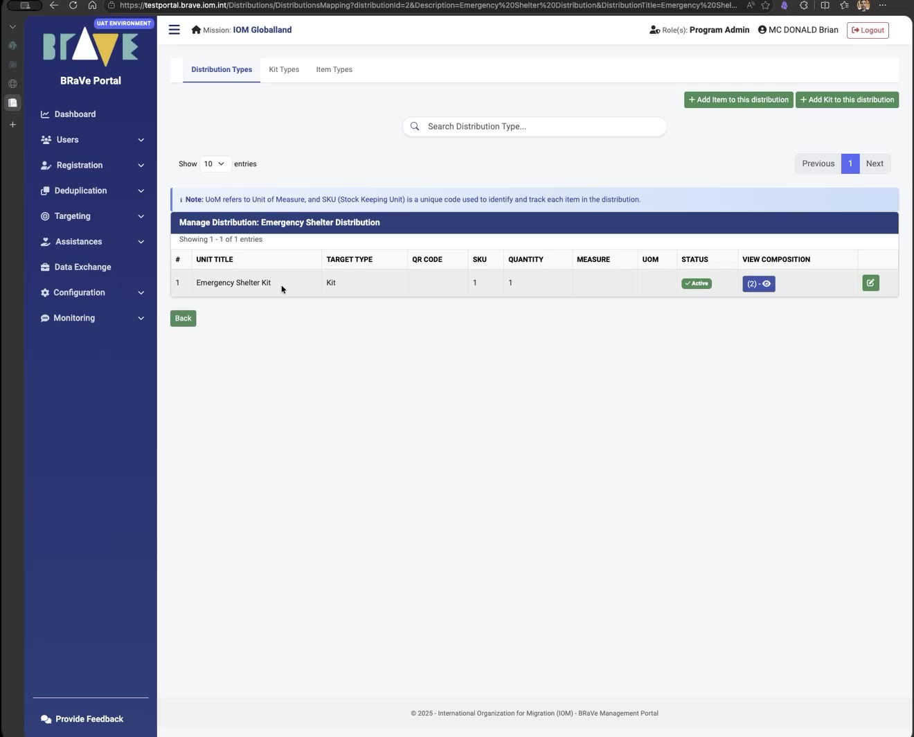{#fig-dist-kit}

#### Other first-time configuration

::: {.callout-warning title="Screenshots to be added"}
The following setup tasks are done in the portal (mostly under **Configuration**) but are not yet illustrated in this guide. They will be documented in their own how-to guides:

- **How to provision devices** — link each phone or tablet to your tenant; each device gets a device code (e.g. `OGAA04`).
- **How to add enumerators** — create the enumerator profiles (each gets a code such as `EN05`) that appear on provisioned devices; enumerator access has an expiry date and can be set inactive.
- **How to configure administrative areas** — load the admin boundaries used in registration.
- **How to add lookups and data fields** — reference lists and custom data points.
- **How to create surveys** — build the household- and individual-level questionnaires attached to activities.
- **How to configure preferences** — mission-wide defaults such as biometric capture.
:::

### Device setup {#device-setup} [MOBILE]{.badge-mobile}

Once the portal setup is complete and devices are provisioned, each enumerator prepares their own device. This takes a few minutes and needs connectivity; after the activity is downloaded, registration can run fully offline.

#### How to log in as an enumerator

1. Open the BRaVe app on a provisioned device. The login screen shows the device code in the title bar, and the environment (e.g. UAT) it is linked to (@fig-app-login).
2. Tap **Search Enumerator** and type your enumerator code (e.g. `EN05`) or name, then select yourself from the list (@fig-enum-search).
3. Tap **Continue**.
4. The first time you log in, set a secure 4-digit PIN. On later logins, enter your PIN (@fig-pin).

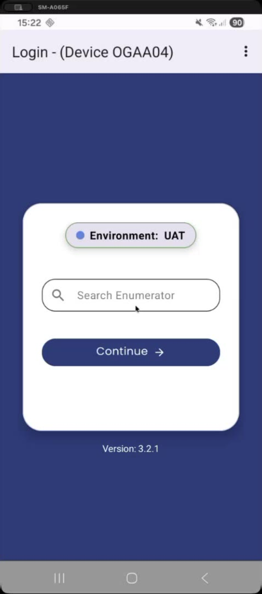{#fig-app-login width=55%}

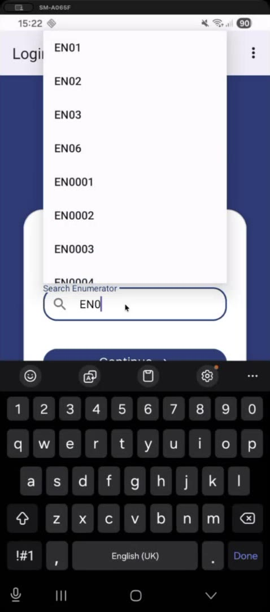{#fig-enum-search width=55%}

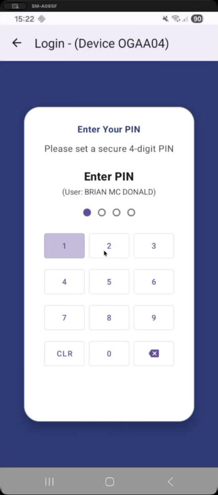{#fig-pin width=55%}

After logging in you see the dashboard. It is empty until you download an activity and start collecting data (@fig-app-dash).

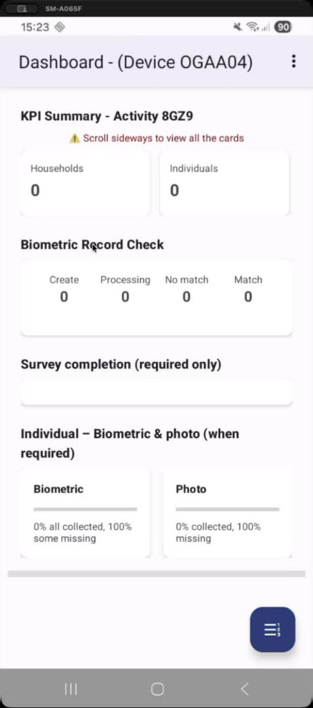{#fig-app-dash width=55%}

#### How to download a field activity onto the device

1. From the dashboard, open the **Field Activity List**.
2. Tap the download button (bottom right).
3. Enter the **activity code** given to you by the programme officer, then tap **OK** (@fig-code).
4. The activity appears in your list with its title, description and active dates (@fig-activity-list).
5. Tap **Refresh** on the activity before going to the field so the device holds the latest configuration (surveys, consent forms, enumerator whitelist).

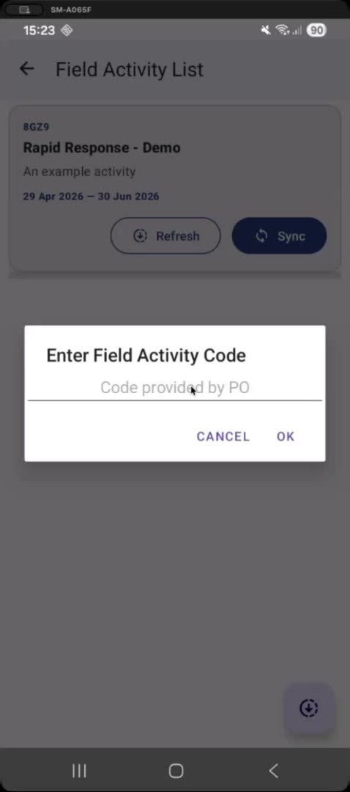{#fig-code width=55%}

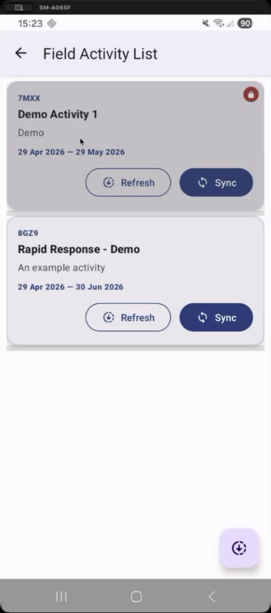{#fig-activity-list width=55%}

::: {.callout-note title="Refresh vs Sync"}
**Refresh** pulls the activity's latest configuration *to* the device. **Sync** pushes collected registration data *from* the device to the portal — run it at the end of each day, or whenever you have connectivity.
:::

#### How to verify an activity is ready for fieldwork

Before travelling to the field, open the activity and confirm it is configured correctly:

1. In the **Field Activity List**, tap the activity to open its details.
2. Check the **Enumerator Whitelist** contains everyone working in this activity (@fig-detail-top).
3. Check the **Consents** section lists the right consent form(s), with the correct required/optional flag and language.
4. Check the **Surveys** section shows the expected household and individual surveys and their required/optional status (@fig-detail-bottom).
5. Confirm the action buttons at the bottom match the work planned: **Registrations**, **Biometric Record Check** and/or **Distributions**.

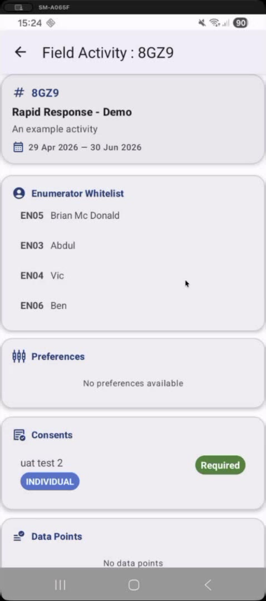{#fig-detail-top width=55%}

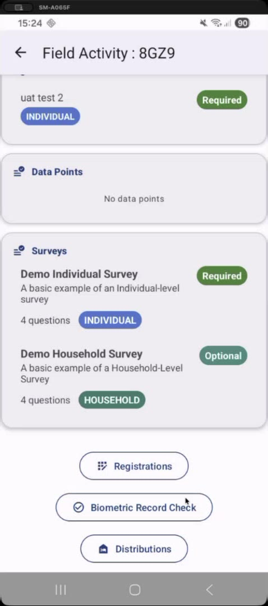{#fig-detail-bottom width=55%}

If anything is missing, correct the activity in the portal, then tap **Refresh** on the device.


## Registration and data management

Registration is the point where people enter the BRaVe database. Enumerators collect data in the mobile app; administrators design the forms beforehand and manage the resulting records afterwards in the portal.

::: {.callout-note title="Registration hierarchy"}
BRaVe registers **households**, then adds **individuals** to them. A household record holds the household ID, size, type and location; each individual holds biographical data, an optional photo and optional biometrics. Surveys can be attached at either level.
:::

### Conducting a registration [MOBILE]{.badge-mobile}

The steps below assume you are logged in as an enumerator and have downloaded the activity onto your device (see [Device setup](#device-setup)). The whole workflow runs offline — you only need connectivity to sync afterwards.

#### How to register a household

1. Open the activity from the **Field Activity List** and tap **Registrations**.
2. Tap **Add Household**. The **New Registration** form opens with the **Household ID** and **Activity Code** already filled in — the household ID is generated from the device code, so IDs never clash between devices (@fig-new-hh).
3. Enter the **Household Size** and select the **Household Type** (e.g. IDP).
4. Tap **Collect** under **Location Coordinates** to capture GPS coordinates. The accuracy is shown next to the reading (@fig-hh-saved).
5. Optionally add **Household Location** free-text address detail.
6. Enter a **Registration Token** only if your operation issues pre-printed tokens; otherwise leave it blank.
7. Tap **save**.

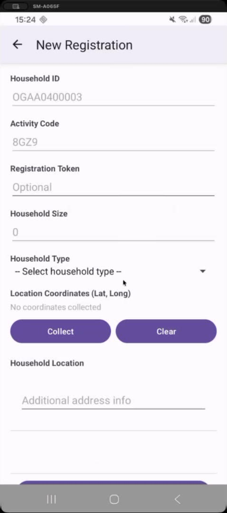{#fig-new-hh width=55%}

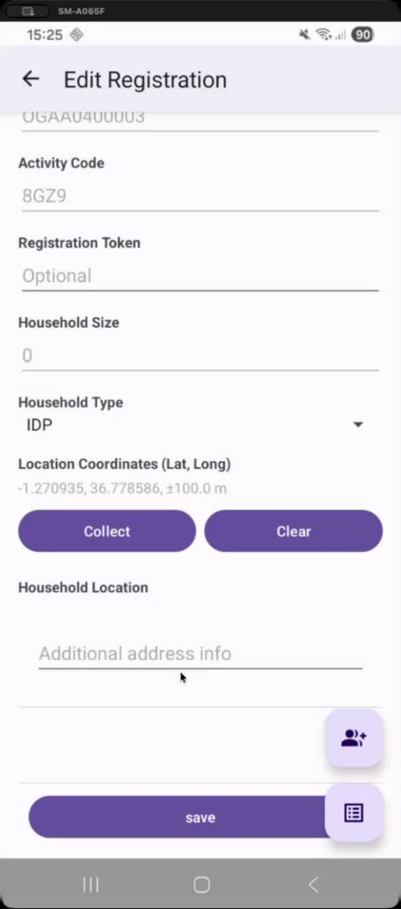{#fig-hh-saved width=55%}

::: {.callout-tip}
If GPS accuracy is poor, tap **Clear** and **Collect** again once you have a better sky view. The reading shown as `±100.0 m` is the accuracy radius, not an error.
:::

#### How to add individuals to a household

A household record is not complete until it has members. Repeat this procedure for every person in the household.

1. From the saved household, tap the **add person** button.
2. If the activity has a required consent form, it appears first. Read it to the respondent and record their answer — **YES** to proceed, **NO** to stop (@fig-consent). Multiple consent forms can be configured, and they appear in sequence.
3. On the **Add Individual** screen, enter the **first name**, optional middle name and **last name** (@fig-add-ind).
4. Enter the **date of birth**, or use the **Years / Months / Days** fields if the person only knows their approximate age.
5. Select the **Relationship** to the head of household and the **Gender** (@fig-gender).
6. Tap the camera button to take a **photo**, if photos are collected in this activity (@fig-photo-bio).
7. Tap **save**.

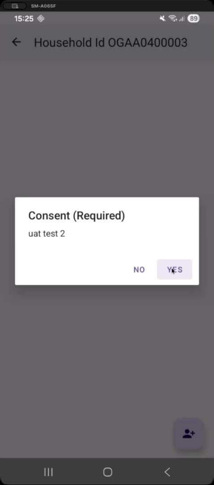{#fig-consent width=55%}

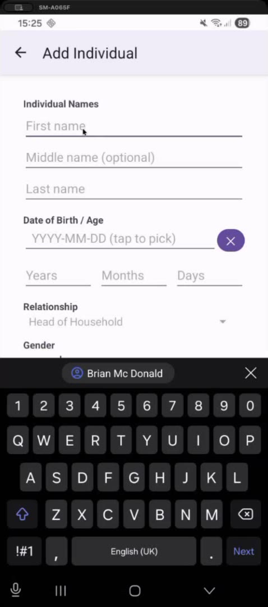{#fig-add-ind width=55%}

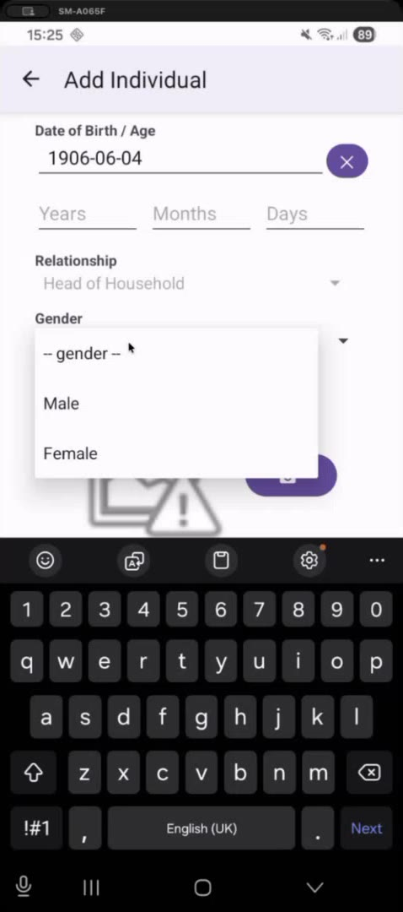{#fig-gender width=55%}

::: {.callout-warning title="Consent first"}
Do not begin data collection before the consent response is recorded. If the respondent declines, stop the registration for that individual.
:::

#### How to capture biometrics

Biometrics are optional and switched on per activity. When enabled, the **Photo & Biometric** section offers a fingerprint button alongside the camera.

1. Save the individual first. The biometric option becomes available on the saved record (@fig-photo-bio).
2. Connect the fingerprint scanner and tap the **fingerprint** button.
3. Place the finger on the scanner. The capture app extracts the minutiae and confirms **Extraction succeeded** (@fig-fingerprint).
4. Tap **Add** to keep the capture, or **Retry** if the quality is poor. Use **Set position** to record which finger was scanned.
5. Repeat for each finger your operation captures.
6. Return to the individual record. A warning reads *"Biometric changes detected. Don't forget to save your changes."* — tap **save** (@fig-bio-saved).

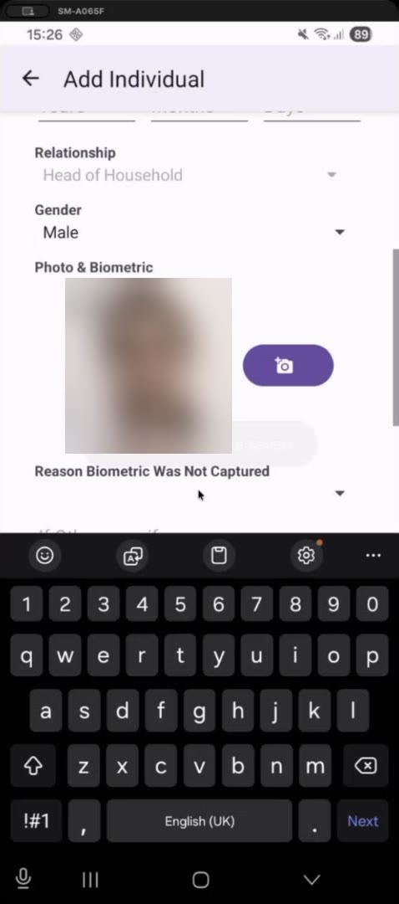{#fig-photo-bio width=55%}

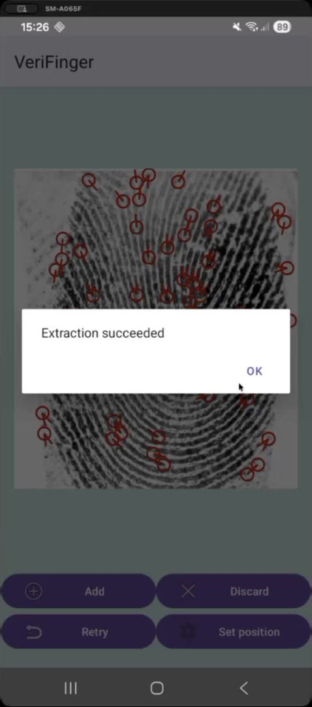{#fig-fingerprint width=55%}

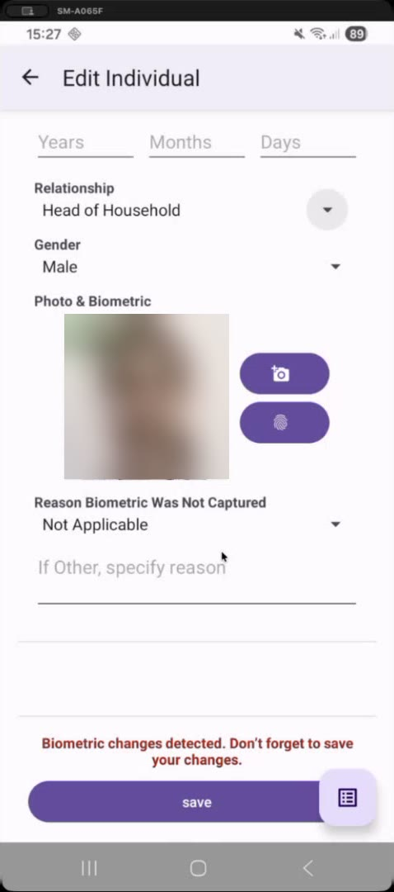{#fig-bio-saved width=55%}

::: {.callout-note title="How many fingers?"}
Capturing more fingers improves deduplication but takes longer per person. Two thumbs is a common compromise and aids cross-agency deduplication; ten digits is the most robust. Decide this before fieldwork starts and apply it consistently.

If a fingerprint cannot be captured, record why using the **Reason Biometric Was Not Captured** field rather than leaving it blank.
:::

#### How to complete surveys

Surveys attached to the activity appear as separate forms, marked **Required** or **Optional**.

1. Open the individual record and tap the **survey** button to complete the individual-level survey. Questions may be dropdowns, numeric inputs or multi-select lists (@fig-ind-survey).
2. Return to the household level and complete the household-level survey the same way (@fig-hh-survey).
3. Save each survey when finished.

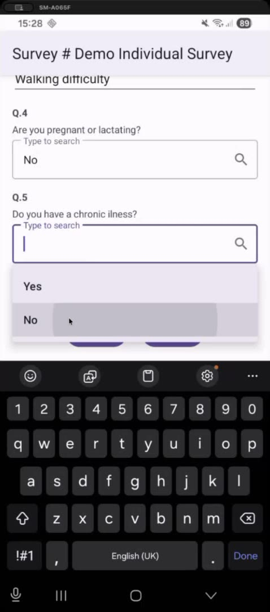{#fig-ind-survey width=55%}

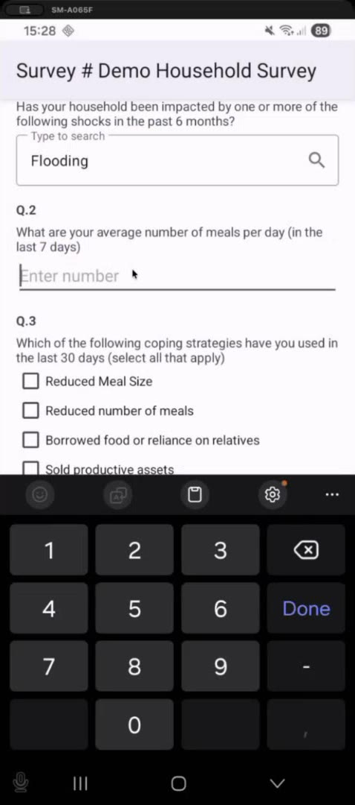{#fig-hh-survey width=55%}

::: {.callout-note}
Both survey levels are optional in BRaVe, and an activity can carry more than one of each — useful when you want a short core form for everyone plus a longer module for a sample of households.
:::

#### How to sync registrations to the portal

Data stays on the device until you sync. Records are not visible in the portal, and cannot be deduplicated or targeted, until this step is done.

1. Go back to the **Field Activity List**.
2. Tap **Sync** on the activity (@fig-sync).
3. Wait for the sync to finish before closing the app.

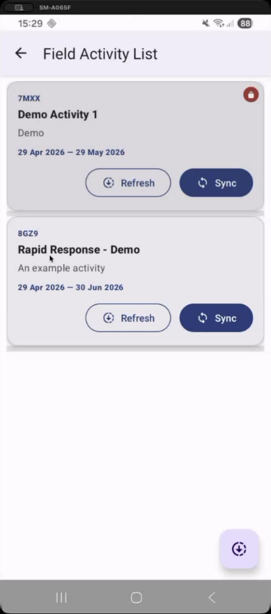{#fig-sync width=55%}

::: {.callout-important}
Sync at the end of every collection day, or whenever you have connectivity. Unsynced data exists only on the device and is lost if the device is lost or damaged.
:::

### Printing beneficiary cards [DESKTOP]{.badge-desktop}

Card printing runs in a separate **BRaVe Card Printing App** on a Windows machine connected to a card printer (e.g. Zebra ZC300). It downloads records from the portal, prints, and reports back which cards were produced.

#### How to print beneficiary cards

1. Open the BRaVe Card Printing App and confirm the **Selected Printer** shown at the top right (@fig-card-app).
2. Choose how to find records:
   - **Household ID** — print for a single household;
   - **Activity** — load everyone registered under an activity code;
   - **Upload File** — supply a text file listing the households to print.
3. Enter the value and click **LOAD RECORDS**. The list shows each person's name, family size, household ID, activity, and whether a card has already been printed (@fig-card-records).
4. Tick the records to print. Records already marked **Printed** are blocked to prevent duplicate cards, unless an administrator authorises a reprint.
5. Select a **Template**. Missions can hold several card designs.
6. Click **PREVIEW CARD** to check the layout, then **PRINT CARD** and confirm.
7. When printing is finished, click **SYNC TO SERVER** so the portal records which cards were printed.

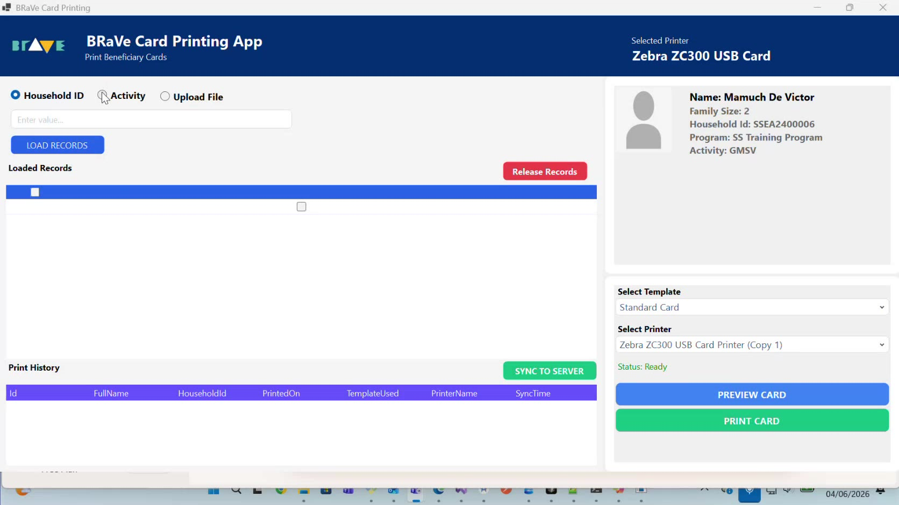{#fig-card-app}

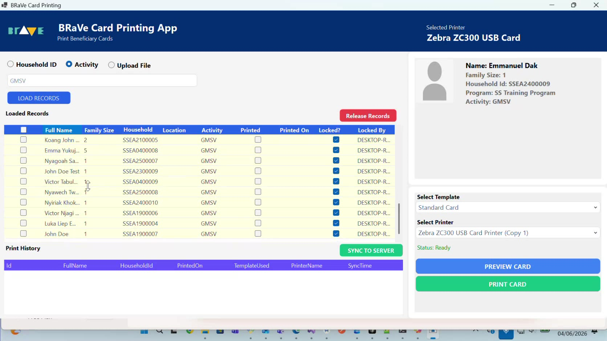{#fig-card-records}

::: {.callout-warning title="Always sync after printing"}
Printed cards are flagged locally until you sync. If two machines print from the same list before syncing, the same person can receive two cards. Sync as soon as a print run finishes.
:::

::: {.callout-note}
Cards can be reprinted (for example, when a card is lost or damaged), but this is a controlled action. Some missions use tokens instead of cards — card printing is optional and configured per mission.
:::

### Managing registration data [PORTAL]{.badge-portal}

::: {.callout-caution title="Draft — not yet verified against the live portal"}
The four procedures below were not covered in the source demo recording. They describe the intended workflow and **must be checked against the live portal, and screenshotted, before this section is published.** Treat field names and button labels as provisional.
:::

#### How to create a custom registration form

Registration forms in BRaVe are built as **surveys** and then attached to an activity, so the same form can be reused across activities.

1. In the portal, go to **Configuration** and open the surveys page.
2. Create a new survey and set its **level**: *Household* or *Individual*. This determines whether it is answered once per household or once per person.
3. Add questions, choosing a field type for each:
   - short text, long text and numeric fields;
   - single-select and multi-select lists (drawn from lookups);
   - date fields;
   - yes/no fields.
4. Set **validation rules** per question — required or optional, and minimum/maximum values or lengths where relevant.
5. Add **conditional logic** where a question should only appear based on an earlier answer (for example, only ask about pregnancy if gender is female).
6. Add **translations** for each question so enumerators can switch language in the field.
7. Save and publish the survey, then attach it to an activity (see *How to configure activities*).

::: {.callout-tip}
Keep required questions to a minimum. Every required field slows down each registration, and at scale a single extra question adds hours of fieldwork.
:::

#### How to edit a beneficiary record

1. In the portal, go to **Registration** and search for the record by household ID, name or activity.
2. Open the record and select **Edit**.
3. Update the biographical fields as needed. Household-level and individual-level data are edited separately.
4. To re-enrol biometrics — for example when the original capture was poor — flag the record for re-enrolment; the next time an enumerator opens it on a device, they can capture new fingerprints.
5. Save the record. All changes are written to the **audit trail**, which records what changed, who changed it and when.

::: {.callout-important}
Records are personal data. Edit only what you can justify, and record the reason where the form allows it — the audit trail is reviewed during data protection audits.
:::

#### How to merge duplicate records

Merging is the resolution step after deduplication has flagged two records as the same person. See the Deduplication section for how matches are found and adjudicated.

1. Open the flagged pair from the deduplication queue.
2. Compare the two records side by side. BRaVe highlights the fields that differ and shows supporting indicators (biometric match score, shared attributes).
3. Decide which record survives. Normally this is the **earlier registration**, so the original registration date is preserved.
4. For each conflicting field, choose which value takes precedence. Prefer the value that is more complete or more recently verified.
5. Confirm the merge. The surviving record keeps a link to the merged record, and the merge is written to the audit trail.

::: {.callout-warning}
Merging is not easily reversible. Where the evidence is ambiguous — common when few people hold ID documents and names are spelled inconsistently — leave the pair unresolved and escalate rather than guessing.
:::

#### How to bulk import beneficiary data

Bulk import brings in beneficiaries registered outside BRaVe, for example from an earlier Kobo exercise.

1. In the portal, go to **Data Exchange** and choose the import option.
2. Download the import template so your file has the expected columns.
3. Prepare your data as CSV or Excel, one row per individual, with a household identifier column linking members of the same household.
4. Upload the file and map each column in your file to the corresponding BRaVe field.
5. Run a **dry run** first. BRaVe validates the file without writing anything and reports errors by row and column.
6. Fix any validation errors in the source file and re-run the dry run until it is clean.
7. Run the import. Imported records enter the same deduplication workflow as records registered on a device.


## Deduplication [PORTAL]{.badge-portal}

Deduplication finds people who have been registered more than once. BRaVe supports two approaches, which are complementary rather than alternatives:

| Approach | Matches on | Available when |
|---|---|---|
| **Biometric** | Fingerprint minutiae, scored numerically | Biometrics were captured during registration |
| **Field-based** | Configurable rules over registration data (names, age, documents, phone) | Always — the only option for imported or non-biometric records |

: {tbl-colwidths="[22,48,30]"}

Both approaches produce **candidate matches**. A candidate match is a suggestion, not a decision. A human then **adjudicates** it — confirming the two records are the same person, or rejecting the match.

::: {.callout-important title="There is no silver bullet"}
Deduplication quality depends on the data available. Field-based matching struggles where few people hold identity documents or phones, names are spelled inconsistently, and ages are approximate. Biometric matching is far more reliable but requires fingerprint capture. Expect a residue of ambiguous pairs in any operation, and plan adjudication time accordingly.
:::

### How to do biometric deduplication and adjudication

Biometric deduplication runs automatically. A background service processes fingerprints as soon as registrations are synced to the portal, so matches are usually waiting for you rather than something you trigger.

#### How to review the biometric match queue

1. In the left menu, open **Deduplication** and select the biometric matching page. The **Deduplication / Biometric matching** tab lists every candidate pair, with the total number of records at the top (@fig-dedup-queue).
2. Narrow the list using the filters if needed:
   - **Activity Code** — restrict to one registration activity;
   - **Date From** / **Date To** — restrict by registration date;
   - **Minimum Score** — hide low-confidence pairs.
3. Click **Apply**. Use **Clear** to reset the filters.
4. Read each row as a pair: the source record on the left, the matched record on the right, and the **Biometric Score** between them. Each side shows registration date, activity code, age, gender and a link to the household.
5. Click **View Match Details** on a pair to adjudicate it.
6. Use **Export to Excel** if you need the queue offline, for example to divide adjudication work across a team.

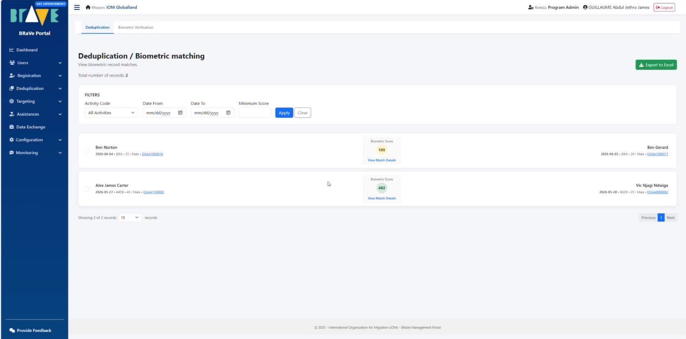{#fig-dedup-queue}


#### How to adjudicate a match

The Match Details screen presents everything needed to decide, and records the decision.

1. Compare the **Source Record** and **Matched Record** side by side (@fig-match-details). Check the photo, name, age, gender, household size, household ID and registration date. Click an image to compare photos directly.
2. Click **View History** under **Match History** to see whether either record has been adjudicated before.
3. Check the **Match Location Map**. It plots where each registration took place and gives the distance between them — 1.21 km in the example. A short distance supports a genuine duplicate; a very large distance is worth questioning.
4. Expand **More information** on either record for the full registration detail.
5. Work through the **Deduplication indicators checklist** and select every option that applies (@fig-dedup-checklist). The indicators are arranged as opposing pairs:
   - biometric match high (score ≥ 200) / biometric match low (score < 200);
   - no biometric, manual deduplication;
   - household names matching / completely different household names;
   - same gender / different gender;
   - matching age / age difference within 5 years / age gap between 5 and 10 years / age gap over 10 years;
   - matching family members / some matches in family members / completely different member names and ages.
6. Click **Generate Suggestion**. BRaVe proposes an action based on the indicators you selected.
7. Decide: **Confirm Match** if the records are the same person, or **Reject Match** if they are not.

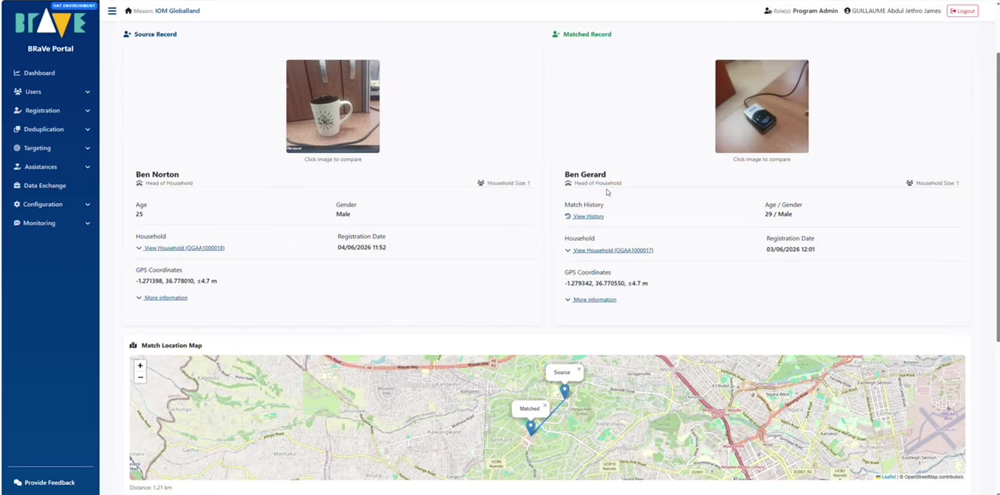{#fig-match-details}

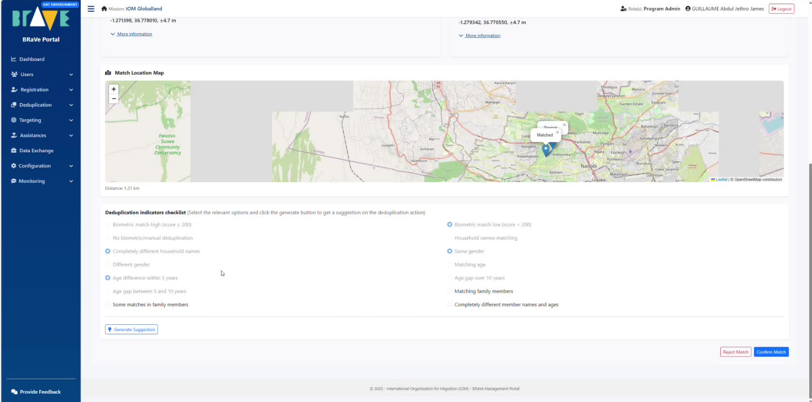{#fig-dedup-checklist}

::: {.callout-warning title="The suggestion is advisory"}
**Generate Suggestion** summarises the indicators you ticked — it does not make the decision for you, and it cannot see anything you have not recorded. The adjudicator remains responsible for the outcome.

Where evidence conflicts — a strong biometric score but completely different household composition, for example — do not force a decision. Leave the pair and escalate it.
:::

::: {.callout-note}
Confirmed matches feed the merge workflow, where you choose which record survives and which field values take precedence. See *How to merge duplicate records* in Registration and data management.
:::

#### How to flag a record for review

Records can also be flagged outside the match queue, for example when an enumerator reports a problem.

1. Go to **Monitoring** and open the **Raw Data** page.
2. Filter by mission, programme, activity and date range, then click **Apply**. You can also search by household, head name, mission or activity.
3. Tick the records concerned and click **Flag for review** (@fig-raw-data). Flagged records show in the **Flagged** column.
4. Use **View Details** to open a record, or **Export CSV** to take the list offline.

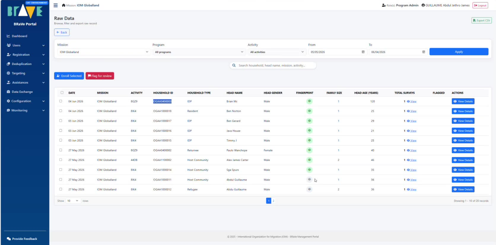{#fig-raw-data}

### How to do field-based deduplication and adjudication

::: {.callout-caution title="Section incomplete — walkthrough required"}
The field-based deduplciation part will be added shortly.
:::

::: {.callout-tip title="Why field-based matching still matters"}
Every record imported from another system arrives without fingerprints, and some operations choose not to collect biometrics at all. In both cases field-based matching is the only deduplication available — so the rules deserve careful design even where biometrics are the primary method.
:::

## Biometric Record Checking

- *How to do a biometric record check*

## Targeting

- *Manual approach*

- *Guided approach*

## Enrolment

- *Manual enrolment*

- *Targeting & eligibility-based enrolment*

## Distribution

- *Defining items, kits and distribution types*

- *Distributing items (mobile)*

- *Monitoring distributions*

## Device Management

- *How to install BRaVe*
